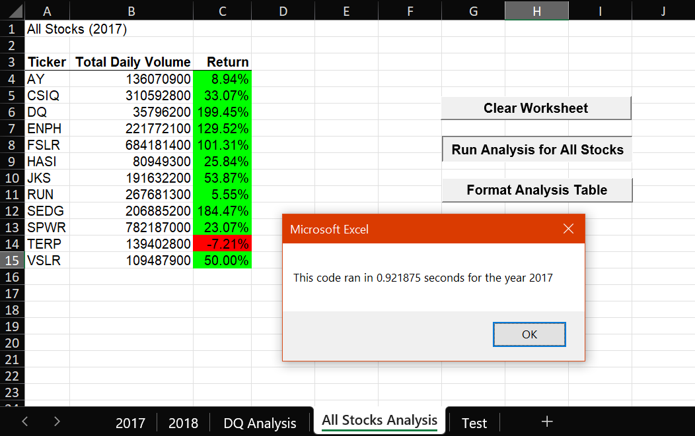
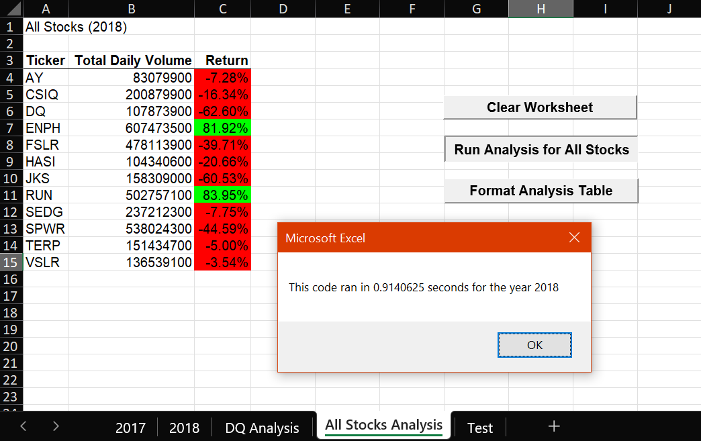

# assignment2_stockanalysis

## Overview

Our good friend Steve has come to us for help to analyze a handful of stocks of green energy companies and assist his parents in their investment strategy. Before we came on board, Steve's parents invested all their money into DAQO New Energy Corp (ticker $DQ) and we are to look into DQ's stock performance as well as a dozen other companies in the industry. We have created a VBA script to run through data for 12 stock tickers for 2017 and 2018 and return total daily volume traded and annual stock performance for each ticker, so Steve can analyze an entire dataset at the click of a button.

Now Steve wants to be able to expand the dataset to analyze the entire stock market over the last few years, so we have to revise our VBA script to refactor the code and make it more efficient and run faster with larger datasets. We have added a timer function to the code to be able to measure and compare how fast the code runs for the original and the refactored scripts.

## Results

### Stock Performance

2017 was a very good year for green energy stocks, with double- and even triple-digit growth for all tickers across the industry (with the notable exception of $TERP down 7% YoY). $DQ in particular overperformed and even topped the industry with an annual return of 199%, way above industry weighted average return of 60%.

  Click image to enlarge

 

 

 

  On the contrary, 2018 was a very tough year and only 2 tickers posted a positive return: $ENPH and $RUN, each above 80% YoY. The industry posted a weighted average return of 7% YoY but looking more closely we can see that $ENPH and $RUN had strong positive returns with high trading volumes that heavily skew the average. The other 10 tickers in our analysis posted a weighted average of -31% YoY, and unfortunately for Steve's parents $DQ strongly underperformed with an annual return of -60%.

  Click image to enlarge

In the next phase of our analysis, it would be interesting to find out:
- why the industry performed so well in 2017 and so poorly in 2018 overall (regulatory change? macroeconomics?)
- why $ENPH and $RUN both managed positive returns in consecutive years, especially in 2018 when the whole industry was underperforming (SWOT)

That will help Steve make better informed guestimates as to stock performance in the coming years.

### Code Performance

## Summary

